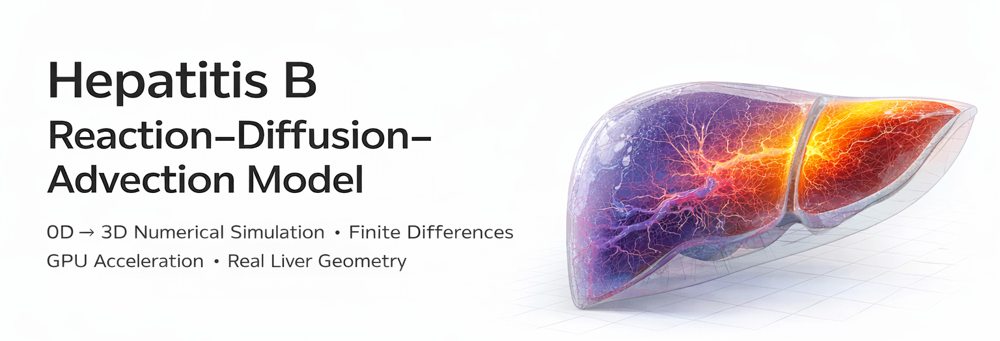
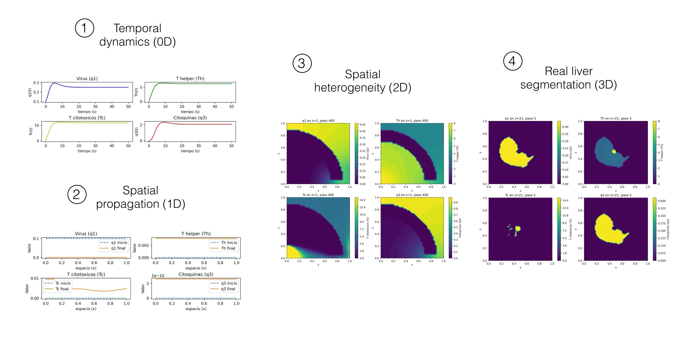
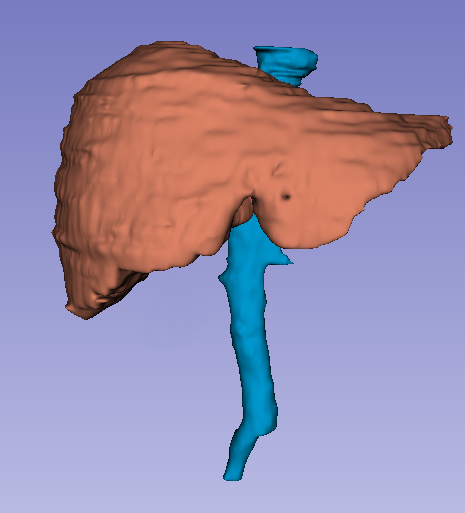

# 🧬 Hepatitis B Reaction–Diffusion–Advection Model

  

Finite-difference implementation of a multi-scale mathematical model (0D → 3D) of chronic Hepatitis B infection, including simulation in segmented real-liver geometry.

---

## 🚀 Project Overview

This project implements a previously developed reaction–diffusion–advection model describing viral dynamics and immune response.

Main features:

- Multi-scale implementation (0D, 1D, 2D, 3D)
- GPU acceleration 
- Real-liver 3D segmented geometry
- Fully reproducible scientific notebooks

---

## 🧠 Mathematical Model

The model describes the spatio-temporal evolution of:

- Viral load (q₁)
- Helper T cells (Tₕ)
- Cytotoxic T cells (T𝚌)
- Cytokine concentration (q₃)

Transport mechanisms:
- Diffusion
- Advection
- Nonlinear reaction terms

Numerical discretization:
Finite Difference Method (explicit scheme).

---

## 📊 Results

  

### 0D — Temporal Dynamics
Time evolution of viral load and immune response.

### 1D — Spatial Propagation
Spatial evolution of viral load an inmune response

### 2D — Spatial heterogeneity

### 3D — Real liver segmentation

---

## 🧪 Reproducibility

All simulations are implemented in Python using NumPy/CuPy and structured as step-by-step Jupyter notebooks.  
The repository allows full reproduction of results from 0D to 3D simulations.
